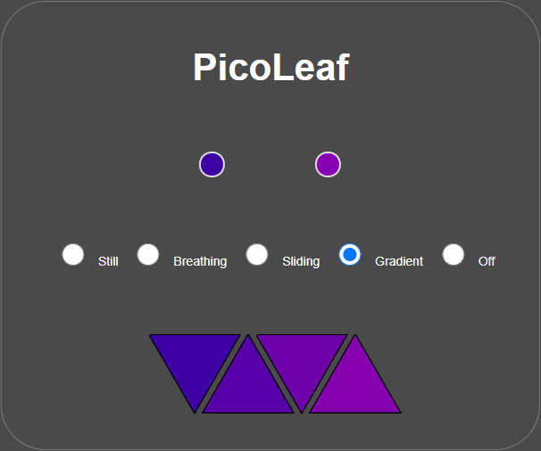

# Picoleaf-ESP8266
This is the management part of the ESP8266-based Nanoleaf-like project (https://github.com/gili-yankovitch/picoleaf-esp8266). This exposes an HTTP endpoint for the ESP8266 to read its configuration from.

## Usage
The `wsgi.py` exposes a flask web server which allows control over the colors / animation presented by the Picoleaf device.  
  
<p align="center">
  
</p>

## Installation and runtime
Just like any other python-based applications, installation is pretty straightforward.  
```
# Install all requirements
pip install -r requirements.txt

# Run application
python ./wsgi.py
```
